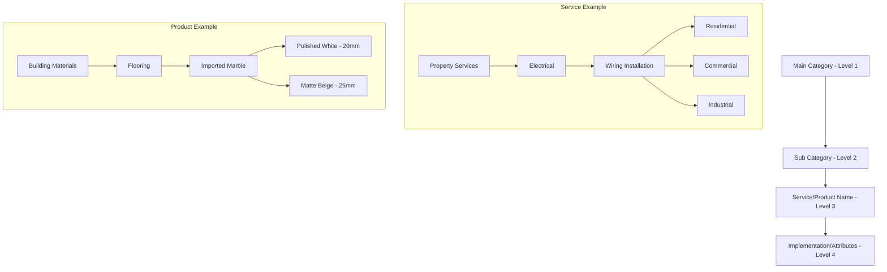
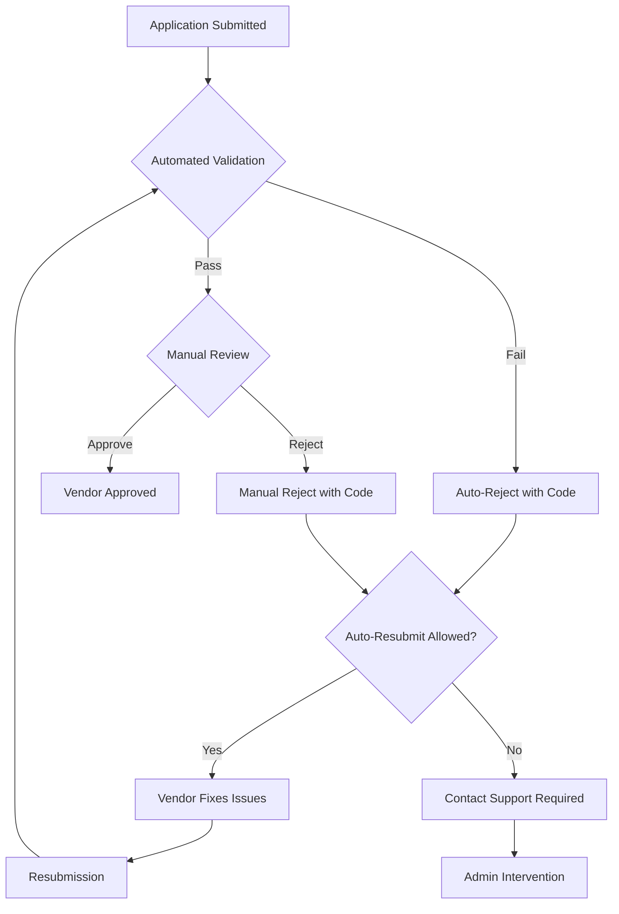

# Complete Vendor Onboarding System Documentation

## 📋 System Overview

This comprehensive vendor onboarding system handles both **Product Vendors** (inventory-based) and **Service Providers** (skill-based) with a 4-level hierarchical categorization, advanced validation, fraud detection, and automated rejection/resubmission workflows.

---

## 🏗️ 1. Hierarchy Visualization



---

## 🗄️ 2. Database Schema

### Core Tables

#### `categories` - Unified 4-Level Hierarchy
```sql
CREATE TABLE public.categories (
  id TEXT PRIMARY KEY,
  name VARCHAR(100) NOT NULL,
  slug VARCHAR(100) UNIQUE NOT NULL,
  type VARCHAR(10) CHECK (type IN ('product', 'service')),
  level SMALLINT CHECK (level BETWEEN 1 AND 4),
  parent_id TEXT REFERENCES categories(id),
  meta JSONB DEFAULT '{}', -- Type-specific data
  display_order INTEGER DEFAULT 0,
  is_active BOOLEAN DEFAULT true
);
```

#### `vendor_applications` - Main Registration Table
```sql
CREATE TABLE public.vendor_applications (
  id UUID PRIMARY KEY DEFAULT gen_random_uuid(),
  user_id UUID REFERENCES auth.users(id) NOT NULL,
  vendor_type VARCHAR(20) CHECK (vendor_type IN ('product', 'service')),
  application_status VARCHAR(20) DEFAULT 'draft',
  business_name VARCHAR(255) NOT NULL,
  business_type VARCHAR(50) NOT NULL,
  business_registration_number VARCHAR(100),
  tax_id VARCHAR(100),
  business_address JSONB DEFAULT '{}',
  contact_info JSONB DEFAULT '{}',
  bank_details JSONB DEFAULT '{}',
  business_documents JSONB DEFAULT '[]',
  category_selections JSONB DEFAULT '[]',
  license_info JSONB DEFAULT '{}',
  service_areas JSONB DEFAULT '[]', -- For service vendors
  product_catalog JSONB DEFAULT '[]', -- For product vendors
  compliance_region VARCHAR(10) CHECK (compliance_region IN ('UAE', 'US', 'EU')),
  fraud_score INTEGER DEFAULT 0 CHECK (fraud_score BETWEEN 0 AND 100),
  rejection_reason VARCHAR(50),
  rejection_details JSONB DEFAULT '{}'
);
```

---

## ✅ 3. Validation System

### Validation Rules Matrix

| Field Name | Vendor Type | Validation Type | Logic | Error Message | Region |
|------------|-------------|-----------------|-------|---------------|---------|
| `business_registration_number` | both | regex | `^(CN\|BN)-\d{7}$` | "UAE format: CN-1234567" | UAE |
| `business_registration_number` | both | regex | `^[A-Z]{2}\d{8}$` | "US format: AB12345678" | US |
| `tax_id` | both | regex | `^\d{15}$` | "UAE: 15 digits required" | UAE |
| `tax_id` | both | regex | `^\d{2}-\d{7}$` | "US EIN: 12-3456789" | US |
| `product_sku` | product | regex | `^[A-Z]{3}-\d{6}$` | "SKU format: ABC-123456" | All |
| `hourly_rate` | service | range | `min: 10, max: 1000` | "Rate: 10-1,000 currency" | All |
| `bank_account_number` | both | custom | `fraud_check: true` | "Account already registered" | All |

### Dynamic Validation Implementation

```javascript
// Real-time validation function
const validateField = (fieldName, value, vendorType, region) => {
  const rules = getValidationRules(fieldName, vendorType, region);
  
  for (const rule of rules) {
    switch (rule.validation_type) {
      case 'regex':
        if (!new RegExp(rule.validation_logic.pattern).test(value)) {
          return { valid: false, message: rule.error_message };
        }
        break;
      case 'range':
        const num = parseFloat(value);
        if (num < rule.validation_logic.min || num > rule.validation_logic.max) {
          return { valid: false, message: rule.error_message };
        }
        break;
      case 'custom':
        return await customValidation(fieldName, value, rule.validation_logic);
    }
  }
  return { valid: true };
};
```

---

## ❌ 4. Rejection Management System

### Rejection Codes Reference

| Code | Category | Description | Auto-Resubmit | Fix Time (hrs) |
|------|----------|-------------|----------------|----------------|
| `DOC-MISSING` | Documentation | Required documents missing | ✅ | 24 |
| `LICENSE-INVALID` | Licensing | Invalid/expired license | ✅ | 72 |
| `BANK-DUPLICATE` | Financial | Duplicate bank account (fraud) | ❌ | 168 |
| `ADDR-UNVERIFIED` | Address | Address verification failed | ✅ | 48 |
| `CAT-MISMATCH` | Category | Categories don't match license | ✅ | 24 |
| `PRICE-INVALID` | Pricing | Unrealistic pricing | ✅ | 12 |
| `INFO-INCOMPLETE` | Information | Incomplete information | ✅ | 24 |
| `QUALITY-CONCERN` | Quality | Quality/reference concerns | ❌ | 120 |
| `FRAUD-SUSPECTED` | Security | Fraud detection triggered | ❌ | 240 |
| `REGION-RESTRICTED` | Geographic | Region licensing issues | ✅ | 96 |

### Rejection & Resubmission Flow



---

## 🔒 5. Fraud Detection Patterns

### Fraud Pattern Types

| Pattern Type | Detection Logic | Risk Score | Auto-Reject |
|--------------|-----------------|------------|-------------|
| `duplicate_bank` | Same account number | 90 | ✅ |
| `suspicious_address` | PO Box/residential only | 70 | ❌ |
| `rapid_applications` | 3+ apps same IP/24hrs | 60 | ❌ |
| `document_similarity` | 95%+ image similarity | 80 | ❌ |
| `blacklisted_info` | Blacklist match | 100 | ✅ |

### Fraud Score Calculation

```javascript
const calculateFraudScore = async (applicationData) => {
  let score = 0;
  const patterns = await getFraudPatterns();
  
  for (const pattern of patterns) {
    if (await checkPattern(applicationData, pattern)) {
      score += pattern.risk_score;
    }
  }
  
  return Math.min(score, 100); // Cap at 100
};
```

---

## 🌍 6. Regional Compliance

### Document Requirements by Region

#### UAE Requirements
- ✅ **Trade License** (DED issued)
- ✅ **VAT Registration Certificate** (FTA)
- ✅ **Bank Statement** (3 months)
- ✅ **Professional License** (service providers)
- ⚠️ **Import License** (products only)

#### US Requirements  
- ✅ **Business License/Incorporation**
- ✅ **EIN Certificate** (IRS)
- ✅ **Liability Insurance Certificate**
- ✅ **Trade License** (state-specific)
- ⚠️ **Reseller Permit** (products only)

#### EU Requirements
- ✅ **Business Registration**
- ✅ **VAT Number**
- ✅ **Insurance Certificate**
- ✅ **Professional Certifications**

---

## 🔌 7. API Specifications

### Validation Endpoint

```javascript
// POST /api/validate-field
{
  "field": "business_registration_number",
  "value": "CN-1234567", 
  "vendor_type": "service",
  "compliance_region": "UAE"
}

// Response
{
  "valid": false,
  "error_message": "UAE business registration must be format CN-1234567 or BN-1234567",
  "suggestion": "Use format: CN-XXXXXXX or BN-XXXXXXX"
}
```

### Application Submission

```javascript
// POST /api/vendor-applications
{
  "vendor_type": "service",
  "business_name": "Ahmed's Electrical Services",
  "business_type": "llc",
  "business_registration_number": "CN-1234567",
  "tax_id": "123456789012345",
  "compliance_region": "UAE",
  "category_selections": ["sc1", "sn1", "it1"],
  "business_address": {
    "street": "Sheikh Zayed Road",
    "city": "Dubai",
    "emirate": "Dubai",
    "postal_code": "12345"
  },
  "license_info": {
    "license_number": "ELE-123456",
    "expiry_date": "2025-12-31",
    "issuing_authority": "Dubai Municipality"
  }
}
```

### Webhook Notifications

```javascript
// Rejection Webhook Payload
{
  "event": "application.rejected",
  "application_id": "uuid-here",
  "business_name": "Ahmed's Electrical",
  "rejection_code": "LICENSE-INVALID",
  "rejection_details": {
    "description": "Professional license is invalid or expired",
    "resolution_steps": [
      "Upload current valid license",
      "Ensure license matches business type"
    ],
    "estimated_fix_time_hours": 72,
    "auto_resubmit_allowed": true
  },
  "timestamp": "2024-01-15T10:30:00Z"
}
```

---

## 📊 8. Admin Analytics Dashboard

### Key Metrics

```javascript
// Application Status Distribution
{
  "total_applications": 1247,
  "pending_review": 23,
  "approved": 1156,
  "rejected": 68,
  "approval_rate": 92.7,
  "avg_review_time_hours": 18.5
}

// Rejection Analysis
{
  "top_rejection_reasons": [
    {"code": "DOC-MISSING", "count": 25, "percentage": 36.8},
    {"code": "LICENSE-INVALID", "count": 18, "percentage": 26.5},
    {"code": "ADDR-UNVERIFIED", "count": 12, "percentage": 17.6}
  ],
  "resubmission_success_rate": 78.2
}

// Fraud Detection Stats
{
  "applications_flagged": 34,
  "fraud_score_distribution": {
    "low_risk": 1180,
    "medium_risk": 33,
    "high_risk": 34
  },
  "false_positive_rate": 2.1
}
```

---

## 🚀 9. Implementation Phases

### Phase 1: Core System (Weeks 1-2)
- ✅ Database schema setup
- ✅ Basic vendor registration form
- ✅ Category hierarchy management
- ✅ Document upload system

### Phase 2: Validation & Review (Weeks 3-4)
- ✅ Dynamic validation engine
- ✅ Admin review dashboard
- ✅ Approval/rejection workflows
- ✅ Email notifications

### Phase 3: Advanced Features (Weeks 5-6)
- ✅ Fraud detection system
- ✅ Regional compliance rules
- ✅ Resubmission workflows
- ✅ Analytics dashboard

---

## 🛠️ 10. Technical Integration

### Frontend Components

```javascript
// Vendor Registration Component
import VendorOnboardingSystem from '@/components/vendor/VendorOnboardingSystem';

// Admin Management Component  
import VendorApplicationManagement from '@/components/admin/VendorApplicationManagement';

// Category Hierarchy Management
import VendorCategoryManagement from '@/components/admin/VendorCategoryManagement';
```

### Database Queries

```sql
-- Get vendor application with hierarchy
SELECT 
  va.*,
  array_agg(c.name ORDER BY c.level) as category_path
FROM vendor_applications va
LEFT JOIN categories c ON c.id = ANY(va.category_selections::text[])
WHERE va.id = $1
GROUP BY va.id;

-- Fraud detection query
SELECT 
  va1.id,
  va1.business_name,
  COUNT(va2.id) as duplicate_count
FROM vendor_applications va1
JOIN vendor_applications va2 ON 
  va1.bank_details->>'account_number' = va2.bank_details->>'account_number'
  AND va1.id != va2.id
GROUP BY va1.id, va1.business_name
HAVING COUNT(va2.id) > 0;
```

---

## 📋 11. Testing Scenarios

### Validation Testing

```javascript
// Test UAE business registration validation
await testValidation({
  field: 'business_registration_number',
  validInputs: ['CN-1234567', 'BN-7654321'],
  invalidInputs: ['CN123456', 'AB-1234567', '1234567'],
  region: 'UAE'
});

// Test US EIN validation  
await testValidation({
  field: 'tax_id',
  validInputs: ['12-3456789', '98-7654321'],
  invalidInputs: ['123456789', '12-345678', 'AB-123456'],
  region: 'US'
});
```

### Fraud Detection Testing

```javascript
// Test duplicate bank account detection
await testFraudDetection({
  scenario: 'duplicate_bank_account',
  applications: [
    { business_name: 'Company A', bank_account: '1234567890' },
    { business_name: 'Company B', bank_account: '1234567890' }
  ],
  expectedFraudScore: 90,
  expectedAutoReject: true
});
```

---

This comprehensive vendor onboarding system provides enterprise-grade vendor management with automated validation, fraud detection, and streamlined approval workflows. The system is designed to scale and handle complex compliance requirements across multiple regions while maintaining security and user experience.